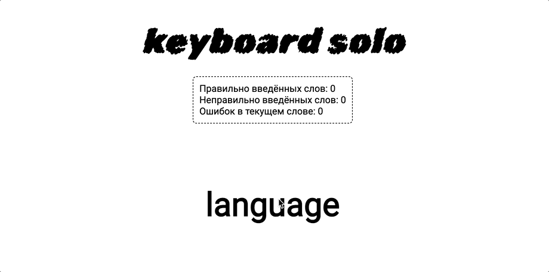
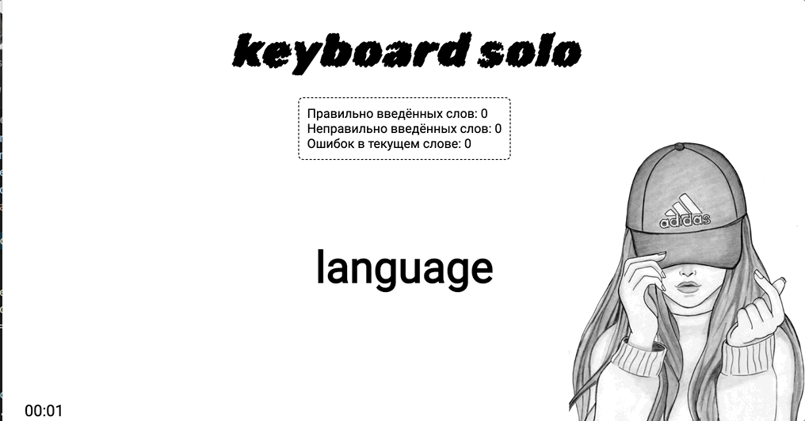

# Домашнее задание к модулю "Продвинутая работа с DOM"

Ты когда-нибудь хотела научиться слепой печати? Предлагаю совместить приятное с полезным и самой написать такой тренажер. Потом на нем можно будет и потренироваться.

Традиционно задание разделено на два уровня сложности. Первый обязателен для получения зачета, а второй — по желанию.

## Базовый уровень сложности

- При загрузке страницы в `div.word` должно подставляться случайное слово. Пользователь вводит его по буквам.

- Если текущий символ введен правильно, он окрашивается в зеленый. Если неправильно, то в красный.

- В случае неправильного ввода текущий символ требуется повторно ввести (любое количество раз — до победного)

- В конце все слово должно стать зеленым

### Демо

## Продвинутый уровень сложности

- После ввода текущего слова до конца на странице должно появляться новое слово.

- Добавь статистику тренировки: сколько слов введено правильно, сколько неправильно, сколько ошибок в текущем слове.

- При 5 правильно введенных словах пользователь выигрывает, а при 5 неправильно введенных словах – проигрывает.

- Добавь отсчет времени, чтобы можно было тренироваться на скорость.

### Демо

